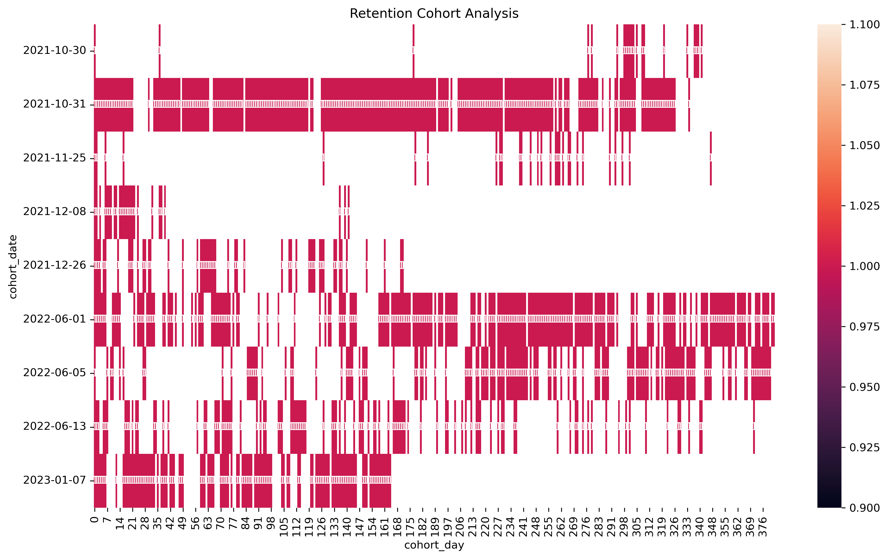
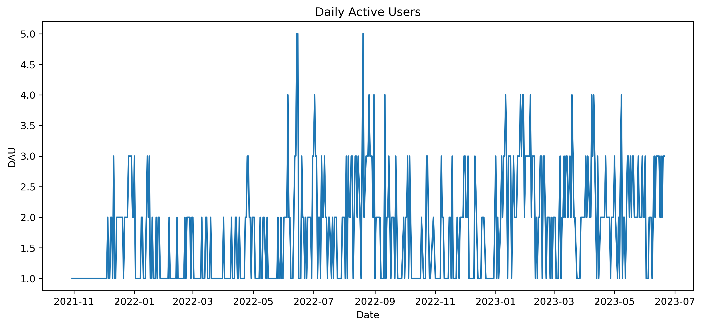

# Netflix User Behavior, Churn & Retention Analysis

## Project Overview

This project analyzes Netflix user behavior to understand engagement, retention, and churn patterns using real user activity data.

The project focuses on identifying early churn signals, analyzing user engagement, and generating product recommendations based on behavioral insights.

Using SQL, PostgreSQL, Python, and data visualization techniques, the analysis covers:

- User engagement analysis
- Churn analysis
- Retention and cohort analysis
- User segmentation
- Behavioral pattern analysis
- Product recommendations

The project follows a product analytics approach by transforming raw user activity data into actionable business insights.

## Dataset

This project uses the [Netflix Watch Log](https://www.kaggle.com/datasets/arjunajn/netflix-watch-log) dataset from Kaggle.

The dataset contains multiple CSV files related to Netflix user activity and platform interactions. These files were imported into PostgreSQL and analyzed using SQL and Python workflows.

- **Viewing Activity** — User watch history and timestamps
- **Clickstream Data** — Navigation and interaction activity
- **Search History** — User search behavior
- **Profiles** — Profile-level information
- **Devices** — Device usage data

## Tech Stack

### Database 
- PostgreSQL
- SQL
- DBeaver

### Data Analysis & Visualization
- Python
- Pandas
- NumPy
- Matplotlib
- Seaborn

### Development Environment
- Jupyter Notebook
- MiniConda

### Analysis Techniques
- Exploratory Data Analysis (EDA)
- Feature Engineering
- Cohort Analysis
- Retention Analysis
- Churn Analysis
- User Segmentation
- Behavioral Analytics

## Workflow

```text
Raw CSV Files
    ↓
PostgreSQL Database
    ↓
SQL Queries
    ↓
Data Cleaning & Feature Engineering
    ↓
EDA & Behavioral Analysis
    ↓
Retention / Churn Insights
    ↓
Product Recommendations
```

## Retention & Cohort Analysis

Retention and cohort analysis were performed to understand how user activity changes over time and how frequently users return to the platform.

The analysis focused on:

- Daily Active Users (DAU)
- User retention trends
- Cohort-based retention patterns
- Returning user behavior
- Churn-related activity decline

Cohort heatmaps and retention metrics were used to identify engagement drop-offs and long-term user activity patterns.

### Retention Cohort Heatmap


### Daily Active Users (DAU)


## User Segmentation

Users were segmented based on engagement and activity behavior to better understand different user groups on the platform.

The segmentation focused on:

- High engagement users
- Medium engagement users
- Low engagement users
- Active vs inactive users
- Churn-risk user groups

Behavioral metrics such as watch frequency, activity level, and session patterns were used to identify engagement differences between users.

## Key Insights

- Users with lower engagement levels showed higher churn risk.
- Retention rates declined significantly after initial user activity periods.
- Highly active users demonstrated more consistent return behavior.
- Search and navigation activity were positively associated with engagement.
- Activity frequency and recent inactivity were strong indicators of churn behavior.
- Cohort analysis revealed noticeable engagement drop-offs over time.

## Product Recommendations

Based on the behavioral analysis and retention insights, several product improvement ideas were identified:

- Improve personalized content recommendations for low-engagement users
- Enhance onboarding experience to increase early user activity
- Introduce re-engagement notifications for inactive users
- Optimize content discovery and search experience
- Monitor early churn indicators to support retention strategies

These recommendations aim to improve user engagement, increase retention, and reduce churn risk.
